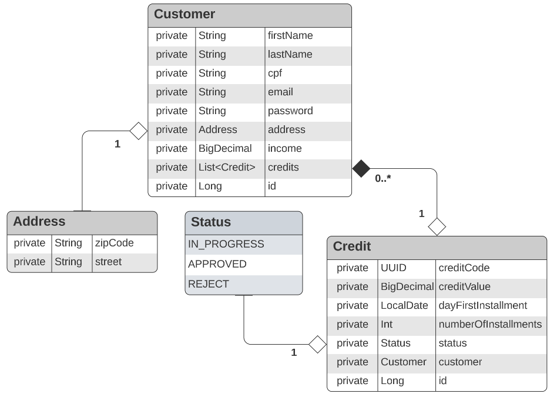
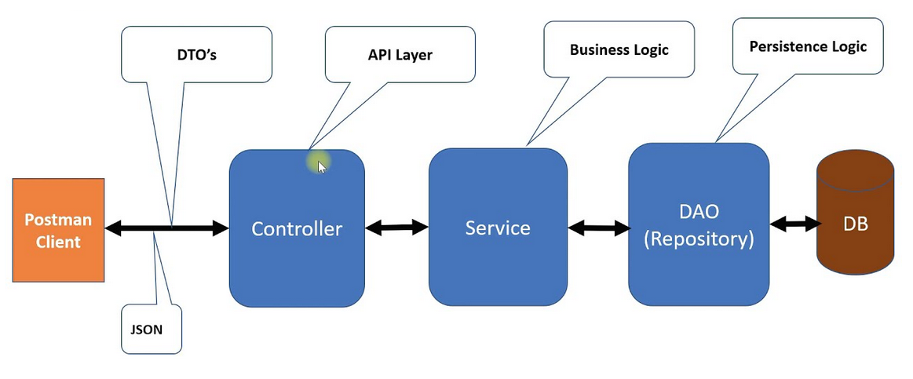

<h1>Sistema de Avaliação de Crédito</h1>

<p align="center">API Rest para um Sistema de Analise de Solicitação de Crédito</p>

<p align="center">
     <a alt="Java">
        
    </a>
    <a alt="Kotlin">
        
    </a>
    <a alt="Spring Boot">
        
    </a>
    <a alt="Gradle">
        
    </a>
    <a alt="H2 ">
        
    </a>
    <a alt="Flyway">
        
    </a>
</p>

## Sobre o Projeto 📝

Bem-vindo ao Projeto de Sistema de Avaliação de Crédito! 🚀 Esta é uma API REST desenvolvida em Spring Boot e Kotlin,
projetada para atender às necessidades de uma empresa de empréstimo. Com esta API, a empresa pode oferecer
funcionalidades de cadastro de clientes e solicitação de empréstimos. Vamos dar uma olhada nos principais recursos
disponíveis:

## Recursos do Cliente (Customer) 🧑👩🧑‍💼

### Cadastrar Cliente

- **URL:** `/api/customers`
- **Método:** `POST`
- **Request:**
    - `firstName`, `lastName`, `cpf`, `income`, `email`, `password`, `zipCode`, `street`
- **Response:** ID do cliente cadastrado

### Editar Cadastro de Cliente

- **URL:** `/api/customers/{id}`
- **Método:** `PUT`
- **Request:** `firstName`, `lastName`, `income`, `zipCode`, `street`
- **Response:** Detalhes atualizados do cliente

### Visualizar Perfil do Cliente

- **URL:** `/api/customers/{id}`
- **Método:** `GET`
- **Response:** Detalhes do cliente

### Deletar Cadastro de Cliente

- **URL:** `/api/customers/{id}`
- **Método:** `DELETE`
- **Response:** Sem retorno

## Recursos de Solicitação de Empréstimo (Credit) 💰📝

### Cadastrar Solicitação de Empréstimo

- **URL:** `/api/credits`
- **Método:** `POST`
- **Request:**
    - `creditValue`, `dayFirstOfInstallment`, `numberOfInstallments`, `customerId`
- **Response:** Código da solicitação de empréstimo

### Listar Solicitações de Empréstimo de um Cliente

- **URL:** `/api/customers/{customerId}/credits`
- **Método:** `GET`
- **Response:** Lista de solicitações de empréstimo

### Visualizar uma Solicitação de Empréstimo

- **URL:** `/api/customers/{customerId}/credits/{creditCode}`
- **Método:** `GET`
- **Response:** Detalhes da solicitação de empréstimo

---

## Diagrama UML 📊

Abaixo está o diagrama UML do projeto, que ilustra as entidades e seus relacionamentos.



## Arquitetura em 3 Camadas 🏗️

Este projeto segue a arquitetura em três camadas do Spring Boot, garantindo uma separação clara entre a camada de
apresentação, serviço e persistência.



---

## Configuração e Execução 🚀

Para executar o projeto localmente, siga os passos abaixo:

1. Clone este repositório:

   ```bash
   https://github.com/rafaelmachadobr/CreditApplicationSystem.git
   ```

2. Acesse o diretório do projeto:

   ```bash
    cd CreditApplicationSystem
    ```

3. Execute o projeto com o Gradle:

   ```bash
   ./gradlew bootRun
   ```

## Licença 📜

Este projeto está licenciado sob a licença MIT - consulte o arquivo [`LICENSE`](LICENSE) para obter detalhes. Aproveite!
😊

Sinta-se à vontade para explorar as funcionalidades e a arquitetura da API, e não hesite em entrar em contato se
precisar de mais informações ou assistência! 👋
